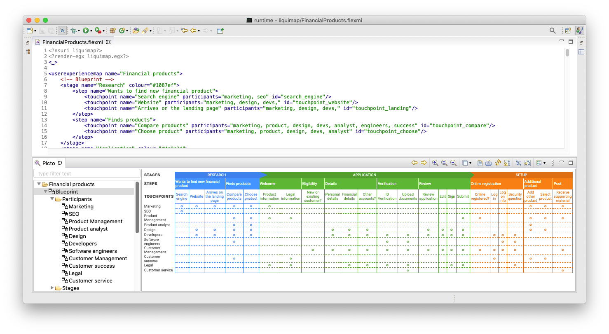
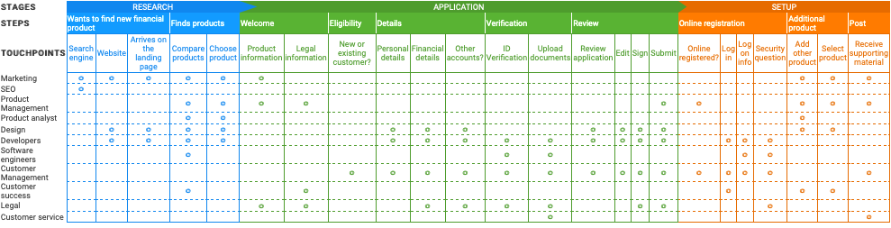
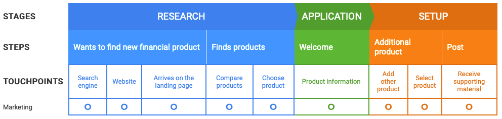
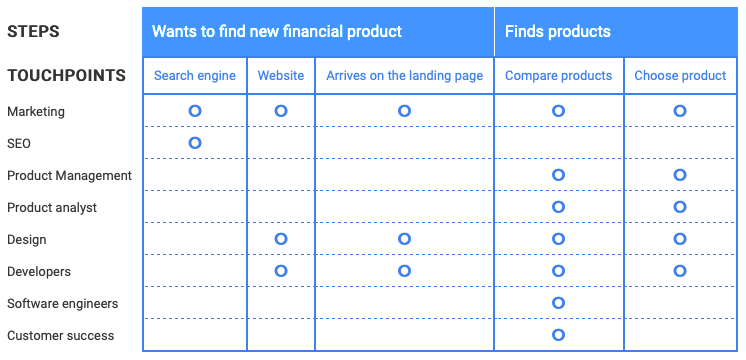
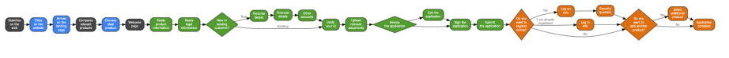
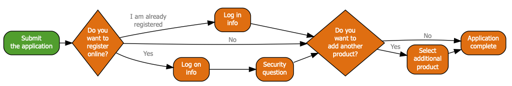
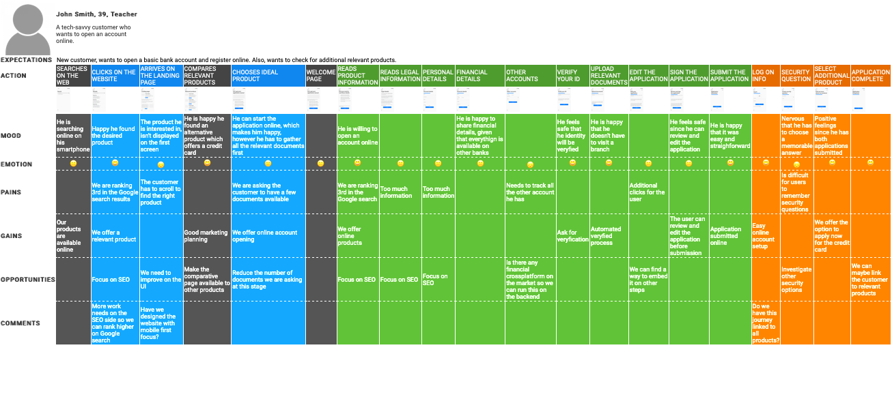
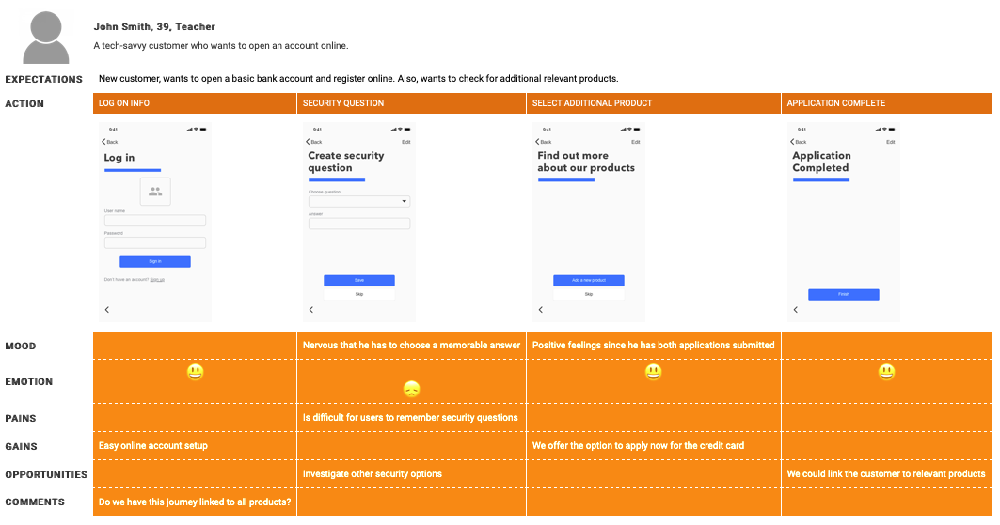
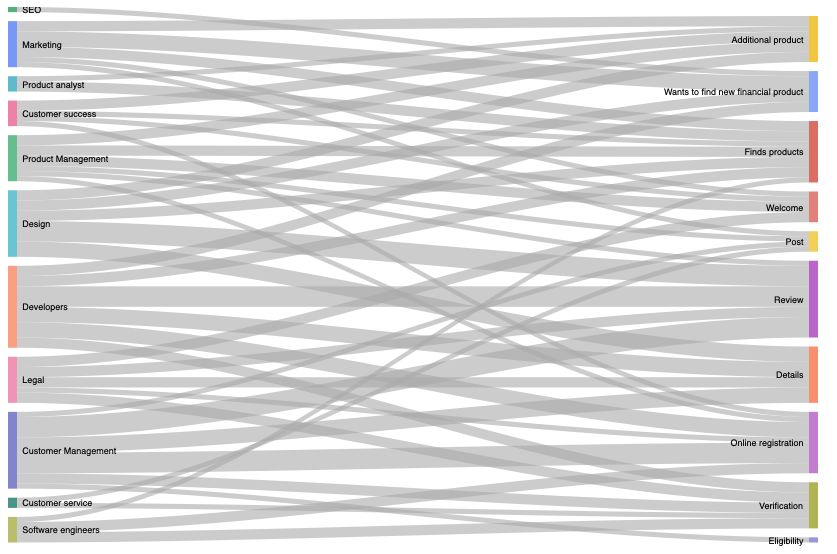

# Liquimap

Liquimap is an EMF-based domain-specific language for user experience (UX) mapping.

## Installation

-  Install OpenJDK 11 (LTS) - HotSpot from https://adoptopenjdk.net/

- Install the Epsilon Eclipse distribution, following the instructions in https://www.eclipse.org/epsilon/download/

- Clone this repository and import the `liquimap` Eclipse project, as instructed in section 9.2 of https://www.vogella.com/tutorials/Eclipse/article.html

- In the `Project Explorer` view of Eclipse, locate and right-click on the `liquimap.emf` file and click `Register EPackages`

- Open the `Picto` view through Eclipse’s `Window` → `Show View` → `Other...` menu

- Double-click on the `FinancialServices.flexmi` file in the `Project Explorer` view to open it. Once the Flexmi file is opened, your Eclipse should look like this

## Gallery

Below are examples of diagrams produced by Liquimap.

### Service Blueprints

#### Global Service Blueprint

#### Service Blueprint by Participant

#### Service Blueprint by Stage

### User Experience Flow Diagrams

#### Global User Experience Flow Diagram

#### User Experience Flow Diagram by Stage

### User Journey diagrams

#### End-to-end User Journey Diagram

#### User Journey Diagram by Stage

### Sankey Diagram

